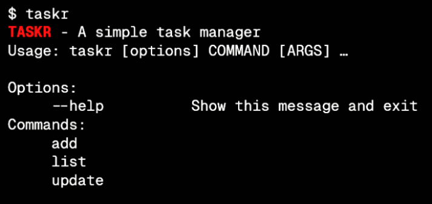

# `taskr` – A Python CLI Task Tracker

<p align="center"> 
  
</p>

<p align="center">
   A minimal, command-line tool written in Python to track your to-dos directly from the terminal. Create, update, and manage tasks using simple commands — no database or external libraries required. Tasks are stored locally in a JSON file.
</p>
<!--
<p align="center">
   <a href="https://github.com/brandonpilane/taskr">
      
   </a>
   <a href="https://github.com/brandonpilane/taskr/issues">
      
   </a>
   <a href="https://github.com/brandonpilane/taskr/pulls">
      
   </a>
   <a href="https://github.com/brandonpilane/taskr/stargazers">
      
   </a>
   <a href="https://twitter.com/intent/tweet?text=Check%20out%20taskr%20by%20%40brandonpilane%20https%3A%2F%2Fgithub.com%2Fbrandonpilane%2Ftaskr%20%F0%9F%91%8D">
      
   </a>
</p>
-->

---

## Features

- Add, update, and delete tasks
- Mark tasks as **todo**, **in-progress**, or **done**
- List all tasks or filter by status
- Persistent local storage using `tasks.json`

---

## Why `taskr`?

Most task management apps are overkill for simple to-dos. `taskr` gives you the power of a simple tracker, accessible entirely via your terminal — fast, scriptable, and distraction-free.

---

## 🛠 Installation

### 🔹 Option 1: Install via `pip`

```shell
git clone https://github.com/brandonpilane/taskr.git
cd taskr
pip install .
```

Now you can use `taskr` as a command from anywhere:

```shell
taskr add "Write project README"
```

### 🔹 Option 2: Make it Executable Locally

1. Add the shebang to the top of `taskr.py`:

   ```python
   #!/usr/bin/env python3
   ```

2. Rename the file to `taskr` (no extension) and make it executable:

   ```shell
   chmod +x taskr
   mv taskr ~/.local/bin/
   ```

Make sure `~/.local/bin` is in your PATH.

---

## 🧾 Task Format

Each task in `tasks.json` includes:

```json
{
  "id": 1,
  "description": "Write unit tests",
  "status": "todo"
}
```

_Note: Status can be "todo", "in-progress", or "done"_

## 🧪 Usage

```shell
# Add a new task
taskr add "Refactor codebase"

# Update a task
taskr update 1 "Refactor and document codebase"

# Delete a task
taskr delete 1

# Change the status of a task
taskr status 1 done
taskr status 4 in-progress

# List all tasks
taskr list

# List by status
taskr list --todo
taskr list --in-progress
taskr list --done
```

---

## 📂 File Structure

```
taskr/
├── taskr/
│   ├── __init__.py         # Package initializer
│   └── cli.py              # Contains CLI logic and commands
├── LICENSE                 # MIT license
├── requirements.txt        # Runtime dependencies
├── .gitignore              # Excludes tasks.json, .venv/, __pycache__/, etc.
├── tasks.json              # Auto-generated task database (excluded from git)
├── setup.py                # Package metadata for pip install
└── README.md               # Project overview and usage
```

---

## 📦 Dependencies

- `click`
- `pathlib`
- `json`
- `setuptools`

---

## 🧠 Getting Started with Development

1. **Fork and clone this repo**

```shell
git clone https://github.com/your-username/taskr.git
cd taskr
```

2. **(Optional but recommended) Create a virtual environment**

```shell
python -m venv .venv
source .venv/bin/activate  # On Windows: .venv\Scripts\activate
```

3. **Install dependencies**

```shell
pip install -r requirements.txt
```

4. **Install the package in editable mode**

```shell
pip install -e .
```

5. **Edit `taskr/cli.py` to improve or customize CLI functionality**

6. **Run the CLI locally**

```shell
taskr add "Test task"
taskr list
taskr done 1
```

7. **Commit your changes and push your branch**

8. **Create a pull request** with improvements or fixes

---

## 💡 Future Ideas

- Tagging system for tasks
- Due dates and reminders
- Integration with shell prompts (e.g., show active task)

---

## 📄 License

[MIT](./LICENSE)
